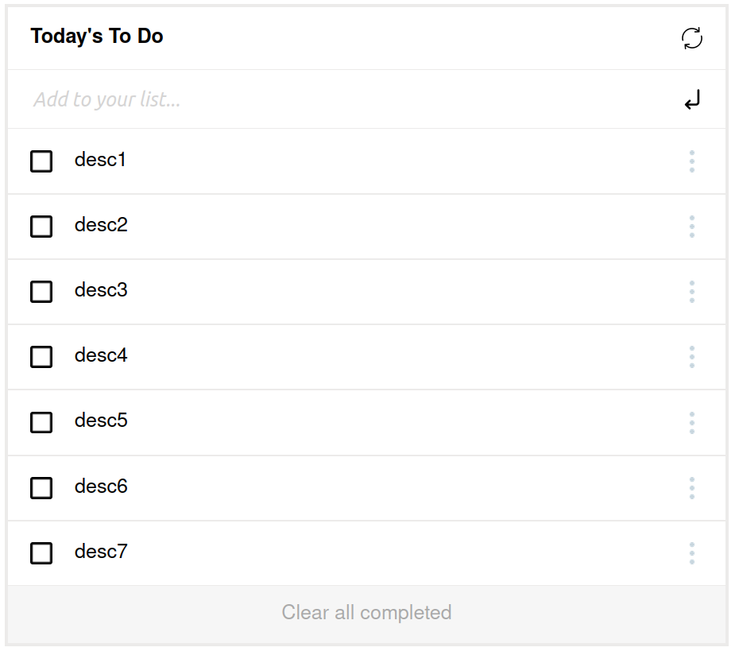

# TODO-LIST PROJECT

> This project is an attemp at recreating [this](https://web.archive.org/web/20180320194056/http://www.getminimalist.com:80/) page. Using Webpack. This project created for the sake of learning.

## Built With

- HTML
- CSS
- Javascript

## Author

👤 David Vergaray

- GitHub:   [@Yothu](https://github.com/Yothu)
- Twiter:   [@Daivhy](https://twitter.com/Daivhy)
- LinkedIn: [David Vergaray](https://www.linkedin.com/in/david-vergaray-almontes-051a11127/)

## 🤝 Contributing

Contributions, issues, and feature requests are welcome!

Feel free to check the [Issues page](./issues/).

## Show your support

Give a ⭐️ if you like this project!

## License

This project is [MIT](./MIT.md) licensed.